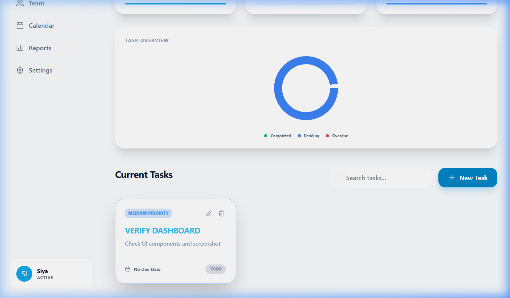
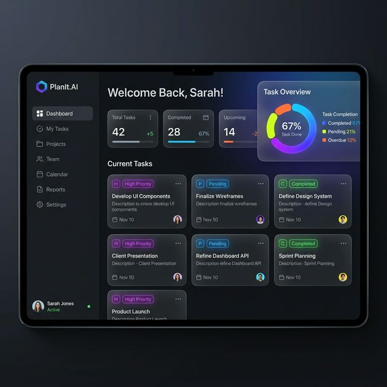

<div align="center">
  
  
  # 🚀 PlanIt.AI - Premium Task Tracker

  [](https://www.mongodb.com/)
  [](https://expressjs.com/)
  [](https://reactjs.org/)
  [](https://nodejs.org/)
  [](https://vitejs.dev/)
  [](https://tailwindcss.com/)

  **A full-stack Task Tracker Web App built with the MERN stack, featuring JWT authentication, real-time analytics, and a premium glassmorphic dashboard.**

  
</div>

<hr />

## 🌟 Key Features

- **🔐 Secure Authentication**: JWT-based login and registration with encrypted passwords (Bcrypt).
- **📋 Task Management**: Full CRUD operations with detailed categories (Work, Personal, Urgent).
- **📊 Real-time Analytics**: Dynamic dashboard showing task completion rates and workload breakdown.
- **✨ Premium UI/UX**: Aesthetic dark mode with glassmorphic elements and smooth micro-animations.
- **📱 Fully Responsive**: Optimized for all screen sizes from mobile to desktop.
- **🛡️ Robust Security**: Protected API endpoints, CORS enabled, and security headers with Helmet.

<div align="center">
  
</div>

## 🛠️ Tech Stack

### Frontend
- **Framework**: [React](https://reactjs.org/) (Vite)
- **Styling**: [Tailwind CSS](https://tailwindcss.com/)
- **Animations**: [Framer Motion](https://www.framer.com/motion/)
- **Icons**: [Lucide React](https://lucide.dev/)

### Backend
- **Runtime**: [Node.js](https://nodejs.org/)
- **Framework**: [Express.js](https://expressjs.com/)
- **Database**: [MongoDB](https://www.mongodb.com/) (Mongoose)
- **Authentication**: JWT & Bcrypt

---

## 🚀 Getting Started

### 1. Prerequisite
- Node.js installed
- MongoDB URI (Local or Atlas)

### 2. Backend Setup
```bash
cd backend
npm install
# Create a .env file:
PORT=5000
MONGODB_URI=your_mongodb_uri
JWT_SECRET=your_jwt_secret
# Run the server:
npm start
```

### 3. Frontend Setup
```bash
cd frontend
npm install
# Run the app:
npm run dev
```

## 📡 API Endpoints

### Authentication
| Method | Endpoint | Description |
| :--- | :--- | :--- |
| `POST` | `/api/auth/register` | Create a new user account |
| `POST` | `/api/auth/login` | Log in and receive JWT |

### Tasks (Protected)
| Method | Endpoint | Description |
| :--- | :--- | :--- |
| `GET` | `/api/tasks` | Fetch all user tasks |
| `POST` | `/api/tasks` | Create a new task |
| `PUT` | `/api/tasks/:id` | Update an existing task |
| `DELETE` | `/api/tasks/:id` | Delete a task |
| `GET` | `/api/tasks/stats` | Get real-time analytics |

---

<div align="center">
  Built with ❤️ by [Siya (jyotii897)](https://github.com/jyotii897)
</div>
